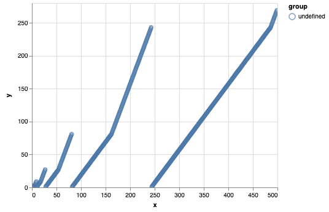
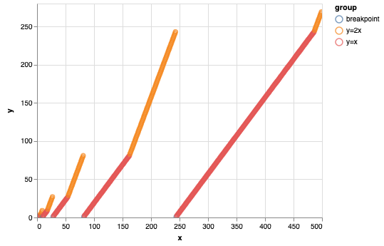

# AoC 2016: Day 19
## Part 2


```python
import pandas as pd
import altair as alt
from itertools import compress, cycle
from collections import deque
from math import log

INPUT = 3014603
```

Let's build a function to compute the result, for small numbers. This will be useful to gain some intuition for the problem, and build a dataset. I will translate the program quite litteraly, using `collections.deque` to rotate the list, and poping the last element. This would take 5 hours to use this function to compute the result, but it won't be necessary.


```python
def last_elf_p2(num_elves: int) -> int:
    """Find part 2 for small num_elves."""
    elves = deque(range(1, num_elves + 1))
    while len(elves) > 1:
        middle = len(elves) // 2
        elves.rotate(-middle - 1)
        elves.pop()
        elves.rotate(middle - 1)
    return elves.pop()


last_elf_p2(5)
```


    2


The function gives the correct answer, so we will build a dataset and plot the result to gain some intuition.


```python
df = pd.DataFrame({'x':range(1, 500)})
df['y'] = df['x'].apply(last_elf_p2)
```


```python
chart = alt.Chart(df).mark_point().encode(
    x='x:Q',
    y='y:Q',
    color='group:N',
    tooltip=['x:Q', 'y:Q', 'group:N']
).interactive()
```


```python
chart
```





We see that for some part of the graph, the slope seems to be `1` and for other, this is `2`. And there are some breakpoints, where the result goes back to one. Let's see where the breakpoints are


```python
df['diff'] = df['y'] - df['y'].shift(1, fill_value=0)
df['group'] = 'breakpoint'
df.loc[df['diff'] == 1, 'group'] = 'y=x'
df.loc[df['diff'] == 2, 'group'] = 'y=2x'
```


```python
chart
```





What it seems is that the breakpoints are exponentially distributed, and that the slope changes in the middle of the interval, at the same value than the preceding max.


```python
df.query('group == "breakpoint"')
```


<div>
<style scoped>
    .dataframe tbody tr th:only-of-type {
        vertical-align: middle;
    }

    .dataframe tbody tr th {
        vertical-align: top;
    }

    .dataframe thead th {
        text-align: right;
    }
</style>
<table border="1" class="dataframe">
  <thead>
    <tr style="text-align: right;">
      <th></th>
      <th>x</th>
      <th>y</th>
      <th>diff</th>
      <th>group</th>
    </tr>
  </thead>
  <tbody>
    <tr>
      <th>1</th>
      <td>2</td>
      <td>1</td>
      <td>0</td>
      <td>breakpoint</td>
    </tr>
    <tr>
      <th>3</th>
      <td>4</td>
      <td>1</td>
      <td>-2</td>
      <td>breakpoint</td>
    </tr>
    <tr>
      <th>9</th>
      <td>10</td>
      <td>1</td>
      <td>-8</td>
      <td>breakpoint</td>
    </tr>
    <tr>
      <th>27</th>
      <td>28</td>
      <td>1</td>
      <td>-26</td>
      <td>breakpoint</td>
    </tr>
    <tr>
      <th>81</th>
      <td>82</td>
      <td>1</td>
      <td>-80</td>
      <td>breakpoint</td>
    </tr>
    <tr>
      <th>243</th>
      <td>244</td>
      <td>1</td>
      <td>-242</td>
      <td>breakpoint</td>
    </tr>
  </tbody>
</table>
</div>


```python
df.query('group == "breakpoint"').index.values
```


    array([  1,   3,   9,  27,  81, 243])


```python
[3**i for i in range(6)]
```


    [1, 3, 9, 27, 81, 243]


What is interesting is that the index are the succeding power of 3 : $x_{breakpoint} = 3^n + 1$. (+1 because x is shiftd by one from the index.)

The points where the slope changes are in the middle of the interval : $x_{slope\ change} = 3^n - 3^{n-1} = 2 * 3^{n-1}$.


```python
df.query('group == "y=2x" and group.shift(1) == "y=x"').index.values
```


    array([  6,  18,  54, 162, 486])


```python
[2 * 3**i for i in range(1, 6)]
```


    [6, 18, 54, 162, 486]


So, we need to figure out where in term of succeding power of 3 we are with our input, and in which half of the interval.


```python
log(INPUT)/log(3)
```


    13.579839638059966


```python
INPUT <= 2 * 3**13
```


    True


This means that the `INPUT` is in the first part of the curve : $y=x$.


```python
INPUT - 3**13
```


    1420280


And this is the correct answer !


```python
def last_elf_p2_exact(num_elves: int) -> int:
    n_pow = int(log(num_elves)/log(3))
    if num_elves == 3 **n_pow:
        return num_elves
    elif num_elves < 2 * 3**n_pow:
        return num_elves - 3**n_pow
    else:
        return 2 * num_elves - 3**(n_pow + 1)
```


```python
last_elf_p2_exact(INPUT)
```


    1420280


```python
df['check'] = df['x'].apply(last_elf_p2_exact)
```


```python
all(df['check'] == df['y'])
```


    True


